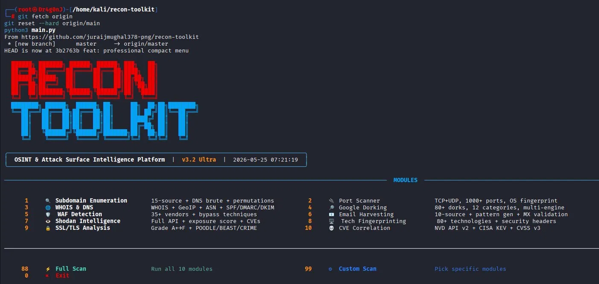

# 🛡 Recon Toolkit Pro v3.2 Ultra

<div align="center">



**Advanced OSINT & Attack Surface Intelligence Platform**

[](https://python.org)
[](https://kali.org)
[](LICENSE)
[](https://github.com/juraijmughal378-png/recon-toolkit)
[](https://github.com/juraijmughal378-png/recon-toolkit/stargazers)

</div>

---

## ⚡ Overview

Recon Toolkit Pro is a fully automated **OSINT & Attack Surface Intelligence** platform built in Python. It combines 10 powerful reconnaissance modules into a single interactive terminal application with professional Rich UI, HTML/JSON/Markdown reporting, and production-grade scanning engines.

> ⚠️ **For authorized security testing only. Do not use against targets you don't own or have explicit permission to test.**

---

## 🔥 Modules

| # | Module | Engine | Sources |
|---|--------|--------|---------|
| 1 | 🔍 Subdomain Enumeration | Ultra 15-source | crt.sh, HackerTarget, AlienVault, Wayback, RapidDNS, ThreatCrowd, Anubis, CommonCrawl, Zone Transfer, DNS Brute, Permutations |
| 2 | 🔌 Port Scanner | TCP + UDP | 1000+ ports, banner grabbing, OS fingerprint, CVE hints, risk scoring |
| 3 | 🌐 WHOIS & DNS | Multi-source | All DNS types, GeoIP, ASN, SPF/DMARC/DKIM, DNSSEC, threat intel |
| 4 | 🔎 Google Dorking | 80+ dorks | 12 categories, Bing/DDG fallback, severity rated |
| 5 | 🛡 WAF Detection | Behavioral | 35+ vendors, payload testing, bypass techniques |
| 6 | 📧 Email Harvesting | 10-source | Website crawl, WHOIS, crt.sh, GitHub, PGP, pattern generation |
| 7 | 👁 Shodan Intelligence | Full API | Exposure scoring, honeypot detection, org search, CVEs |
| 8 | 🖥 Tech Fingerprinting | 80+ techs | CMS, frameworks, servers, CDN, security headers, favicon hash |
| 9 | 🔒 SSL/TLS Analysis | Grade A+→F | 3-method cert, POODLE/BEAST/CRIME/SWEET32, CT logs, HSTS preload |
| 10 | 💀 CVE Correlation | NVD API v2 | CISA KEV, CVSS v3, offline DB, exploit detection |

---

## 🚀 Installation

```bash
# Clone the repository
git clone https://github.com/juraijmughal378-png/recon-toolkit.git
cd recon-toolkit

# Install dependencies
pip install -r requirements.txt

# Run
python3 main.py
```

---

## 🎮 Usage

```bash
python3 main.py
```

```
Select module:
  1-10  →  Single module
  88    →  Full scan (all 10 modules)
  99    →  Custom scan (pick modules)
  0     →  Exit
```

---

## 📁 File Structure

```
recon-toolkit/
├── main.py                  ← Entry point + interactive menu
├── requirements.txt
├── modules/
│   ├── subdomain.py         ← 15-source subdomain enumeration
│   ├── portscan.py          ← TCP+UDP port scanner
│   ├── whois_info.py        ← WHOIS + DNS + GeoIP + ASN
│   ├── dorking.py           ← Google dorking engine
│   ├── waf_detect.py        ← WAF detection + bypass
│   ├── email_harvest.py     ← Email harvesting
│   ├── shodan_lookup.py     ← Shodan API integration
│   ├── fingerprint.py       ← Technology fingerprinting
│   ├── ssl_scan.py          ← SSL/TLS analysis
│   └── cve_check.py         ← CVE correlation engine
├── ui/
│   └── rich_ui.py           ← Terminal UI
├── reports/
│   └── report_gen.py        ← HTML + JSON + Markdown reports
├── wordlists/
│   └── subdomains.txt       ← DNS brute-force wordlist
└── screenshots/
    └── menu.png
```

---

## 🔑 Optional API Keys

```bash
export SHODAN_API_KEY="your_key"    # shodan.io
export NVD_API_KEY="your_key"       # nvd.nist.gov (free)
```

---

## 📊 Reports

After each scan, save reports in 3 formats:
- **HTML** — Interactive dark-theme report
- **JSON** — Machine-readable output
- **Markdown** — Readable text report

Reports saved to `reports/` directory.

---

## 👤 Author

**Juraij Sadaqat**
- GitHub: [@juraijmughal378-png](https://github.com/juraijmughal378-png)

---

<div align="center">
<sub>For authorized security testing only — Recon Toolkit Pro v3.2 Ultra</sub>
</div>
